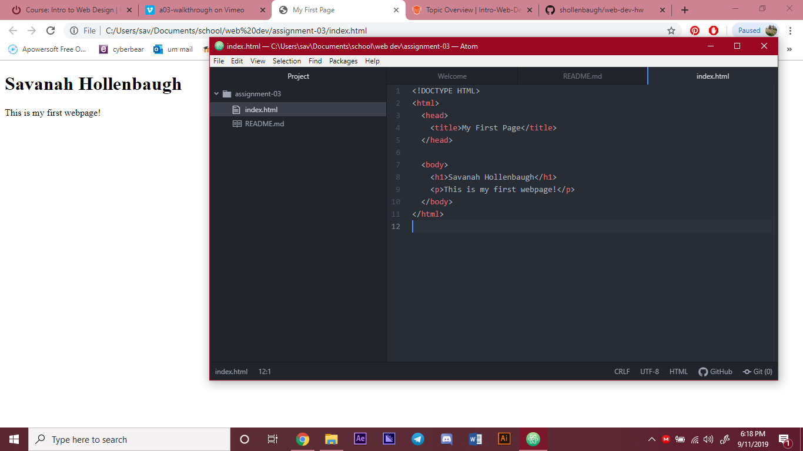

Browsers are software programs that use languages (like HTML) to be translated into what we end up viewing on the web. This includes things such as images, text, and graphics that form the layout or makeup of the website. I frequently use Google Chrome to surf the web.
A markup language is the combination of text, design, and interactivity used to create the layout of a page. It is similar to an architectural plan for buildings or structures. HTML or Hypertext Markup Language is one of the most commonly used markup languages.

