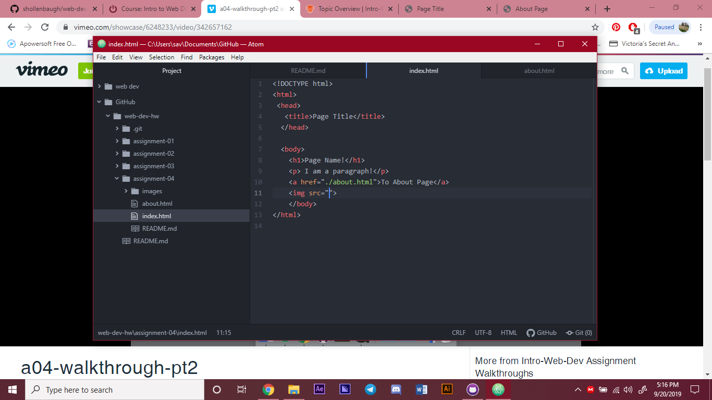

# Assignment 04
## Savanah Hollenbaugh
Using the wayback machine, I visited an older version of Facebook. There are
always subtle changes, like fonts or slight color change, but there are also
big changes, like making the layout different or adding new features to make
the site more functional.

I feel the GitHub module really helps with understanding. It does a good
way of summarizing your walkthrough and giving you more of a feel for creating
websites.

