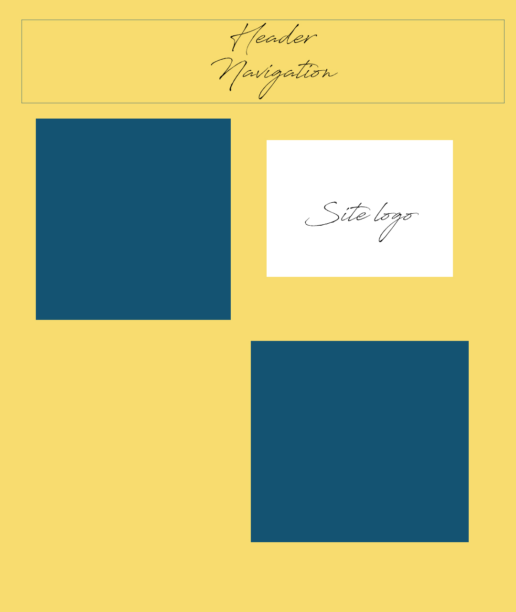

# Assignment 11
## Savanah Hollenbaugh
Borders function as an outline, hugging the outside of an element. Padding puts space between the element and the content inside. Margins are spaces between each element and how they neighbor each other.

Trial and error was a big part of this work cycle. It's not simple to slap elements on a page and be done, it required lots of patience and correction, making things exactly as I wanted them.
